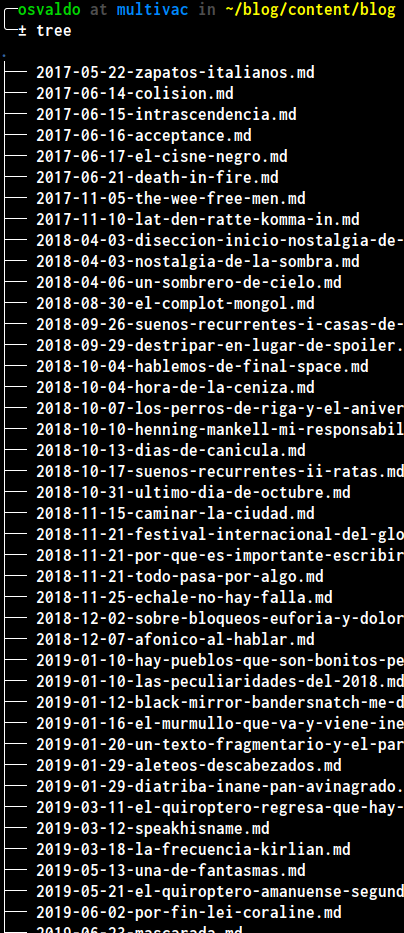
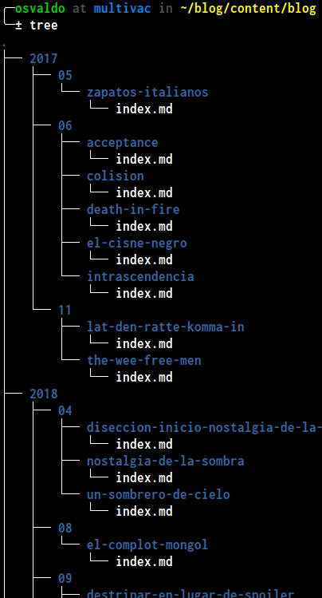

## TL;DR {#TL-DR}
Usa el siguiente fragmento de código en la línea de comandos para cambiar el nombre de todos los archivos en el directorio actual de la forma `AAAA-MM-DD-nombre.md` a `AAAA/MM/DD/nombre/index.md`
```bash
for f in *.md; do mkdir -p "${f:0:4}/${f:5:2}/${f:11:-3}"; mv "$f" "${f:0:4}/${f:5:2}/${f:11:-3}/index.md"; done
```

## Reorganizando un directorio {#reorganizando-un-directorio}

Recientemente me topé con la necesidad de reorganizar la estructura del proyecto de [mi blog](https://quiroptero.blog). Específicamente, quería reestructurar la forma en que se organizan los archivos de contenido en el repositorio con el código fuente.

Ese blog lo tenía en un sitio de Wordpress[punto]com cuando en 2017 comencé a publicar. Funcionó bien durante un tiempo... hasta que ya no. Wordpress[punto]com se hizo fastidioso y migré el blog a Hugo. A raíz de eso adopté una convención simple para nombrar los archivos: `AAAA-MM-DD-nombre.md`. Eso funcionó bien... durante dos días más o menos. Me gustaba que los archivos estuvieran organizados cronológicamente, pero no me gustaba el desorden:





Me agrada la manera en que [el repositorio con el código fuente](https://github.com/Quiroptero/source.omiranda.dev/tree/main/content/posts/) de esta página está organizado. Todos los archivos de contenido siguen esta convención: `AAAA/MM/título/index.lengua.md`
* `título` es un nombre corto y descriptivo que me sirve para entender de qué se trata el contenido de ese directorio.
* `lengua` es el código de lenguaje de ese archivo.

De esa manera puedo mantener con facilidad los archivos para cada lenguaje (inglés y español), así como cualquier recurso necesario (por ejemplo, imágenes) en el mismo directorio. Decidí replicar esa estrategia en la estructura de mi blog, pero hacerlo manualmente era simplemente absurdo. Así es como llegué al comando de [más arriba](#TL-DR). Ese comando está basado en [esta respuesta](https://unix.stackexchange.com/questions/228494/how-to-split-a-directory-of-files-into-sub-directories).

Vamos a dividirlo en partes para explicar cada una:

## Definir el bucle {#for}

La primera parte del comando es:
```bash
for f in *.md; do
```

Esto definirá un bucle sobre una lista de archivos (con alias `f`) que coincidan con el patrón `*.md`; es decir, todos los archivos que terminan con `.md` (archivos tipo _markdown_). La parte `do` se refiere a que para cada elemento en la lista definida dentro del bucle se aplicarán los comandos subsiguientes.


El alias `f` se puede reemplazar con cualquier nombre, como `archivo`, `nombre` o `cosa`.


## Crear el directorio {#mkdir}

Tras definir la lista de archivos, usamos el comando `mkdir` (abreviación de _make directory_) para asegurarnos de que el directorio destino existe:

```bash
mkdir -p "${f:0:4}/${f:5:2}/${f:11:-3}";
```

Por defecto, este comando arroja un error si el directorio especificado ya existe. Necesitamos evitar ese comportamiento, ya que intentaremos crear el directorio destino en cada iteración del bucle. Para ello usamos la opción `-p`, la cual nos permite crear todos los directorios de nivel superior en caso de que no existan.

Ahora la parte divertida: el argumento de `mkdir`.
```bash
"${f:0:4}/${f:5:2}/${f:11:-3}"
```

En realidad es bastante simple.
* Como estamos trabajando con cadenas de texto, encerramos la expresión en comillas dobles `""`.
* El signo de dólar `$` se usa para conseguir [expansión de parámetros](https://zyxue.github.io/2015/03/21/meaning-of-dollar-sign-variables-in-bash-script.html).
* Dividimos la cadena de texto `f` por la posición de sus caracteres:
    * `{f:0:4}`: toma **4** caracteres de `f` empezando en la posición **0**. Esto arroja la parte `AAAA`.
    * `{f:5:2}`: toma **2** caracteres de `f` empezando en la posición **5**. Esto arroja la parte `MM`.
    * `{f:11:-3}`: toma **todos los caracteres, excepto los últimos 3** empezando en la posición **11**. Esto arrija el nombre del archivo menos la extensión `.md`.


Recuerda que los índices de las cadenas de texto comienzan en la posición 0.


Al juntar todo obtenemos `AAAA/MM/filename`.

## Mover (renombrar) los archivos {#mv}

Para finalmente mover (renombrar) los archivos dentro del directorio destino, usamos el comando `mv` (abreviación de _move_).

```bash
mv "$f" "${f:0:4}/${f:5:2}/${f:11:-3}/index.md"
```

El primer argumento indica _qué_ estamos moviendo y el segundo indica _a dónde_ lo estamos moviendo.

* `"$f"`: expande el archivo en cada iteración.
* `${f:0:4}/${f:5:2}/${f:11:-3}`: este es el directorio destino del paso previo.
* `/index.md`: vamos a renombrar todos los archivos.

Marcamos el final del comando:

```bash
; done
```

Y ya está.




