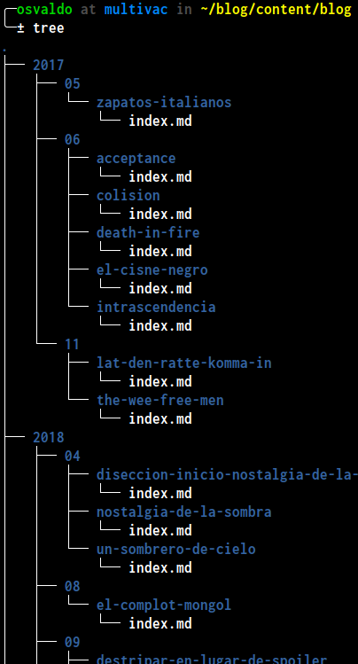

## TL;DR {#TL-DR}
Use the following snippet in the command line to rename all files in the current directory from `YYYY-MM-DD-filename.md` to `YYYY/MM/DD/filename/index.md`
```bash
for f in *.md; do mkdir -p "${f:0:4}/${f:5:2}/${f:11:-3}"; mv "$f" "${f:0:4}/${f:5:2}/${f:11:-3}/index.md"; done
```

## Reorganizing a project directory {#reorganizing-project-directory}

I recently stumbled upon the need to reorganize the project structure of [my blog](https://quiroptero.blog). Specifically, I wanted to restructure the way content files are organized in the source code repository.

When I started to blog back in 2017 I had a Wordpress[dot]com site, which was fine at that moment —until no longer was it. I migrated the blog to Hugo and adopted a simple filenaming convention: `YYYY-MM-DD-filename.md`. That worked well... for two days or so. I liked the files being organized chronologically, but I disliked the clutter:





I like the way the [repository with the source code](https://github.com/Quiroptero/source.omiranda.dev/tree/main/content/posts/) of this webpage is organized. All content files follow this convention: `YYYY/MM/title/index.language.md`
* `title` is a short, descriptive name for me to understand what the content of that directory is about.
* `language` is the language code for that markdown file.

In that way I can easily keep the files for each language and any resource needed (e.g., pictures) in the same directory. I decided to replicate that in the content structure of my blog, but manually doing so was a total mess. That's how I came to get the bash command from the [TL;DR](#TL-DR) based in [this answer](https://unix.stackexchange.com/questions/228494/how-to-split-a-directory-of-files-into-sub-directories).

Let's break it into pieces to explain each part:

## Define loop {#for}

The first part of the command is:
```bash
for f in *.md; do
```

This will define a loop over a list of files (aliased `f`) that match the pattern `*.md`; i.e., all files that end with `.md` (markdown files). The `do` part is straightforward: for each element in the list defined within the for loop, then do (apply) the following commands.


Note that the alias `f` can be replaced with anything, like `file`, `filename` or `goober`.


## Create directory {#mkdir}

After defining the list of files, we use the `mkdir` command (short name for "make directory") to ensure that the target directory exists:

```bash
mkdir -p "${f:0:4}/${f:5:2}/${f:11:-3}";
```

The `mkdir` command by default raises an error if the specified path already exists. We need to avoid that behavior since we will try to create the target directory on each iteration. We pass the `-p` flag to achieve that. That flag also allows us to create the parent directories as needed.

Now it comes the funny part: the argument passed to `mkdir`.
```bash
"${f:0:4}/${f:5:2}/${f:11:-3}"
```

This is actually quite simple.
* We enclose everything in double quotes `""` since we are working with strings.
* The dollar sign `$` is used to perform [parameter expansion](https://zyxue.github.io/2015/03/21/meaning-of-dollar-sign-variables-in-bash-script.html).
* We split the `f` string by its characters position:
    * `{f:0:4}`: take **4** characters from `f` starting at position **0**. This yields the `YYYY` part.
    * `{f:5:2}`: take **2** characters from `f` starting at position **5**. This yields the `MM` part.
    * `{f:11:-3}`: take **all characters but the last 3** starting at position **11**. This yields the filename minus the `.md` extension.


Remember that string indexes start at position 0.


We get `YYYY/MM/filename` by putting everything together.

## Move (rename) files {#mv}

To actually move (rename) the files into the target directory, we use the `mv` (short name for "move") command.

```bash
mv "$f" "${f:0:4}/${f:5:2}/${f:11:-3}/index.md"
```

The first argument passed indicates _what_ are we moving and the second one _where_ are we moving it.

* `"$f"`: expands the file on each iteration.
* `${f:0:4}/${f:5:2}/${f:11:-3}`: this is the target directory from the previous step.
* `/index.md`: we are renaming every file.

We mark the end of the bash command:

```bash
; done
```

And that's it.




