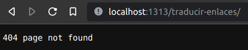
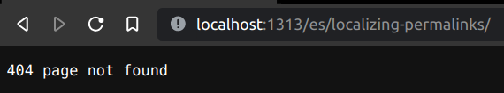


I no longer support Spanish in this website.
Supporting two languages is a big deal and I don't have the time to do it properly.
The workaround described in this post should work.


When working with [Hugo](https://gohugo.io/)'s [multilingual mode](https://gohugo.io/content-management/multilingual/),
it's nothing but natural to wonder whether it exists a direct way to localize (i.e. translate) the permalinks.

I couldn't find a direct way to achieve it.
Fortunately, it does exist a _simple_ way to do it, which I'll cover here.


This article assumes the following prerequisites, which the solution was tested with.
Other configurations should also work after a few tweaks (or none at all).

* **Hugo** >= `0.101`I'm sure this version is way too high for what we're trying to achieve.
* A [Hugo site](https://gohugo.io/commands/hugo_new_site/).
* A [default language set](https://gohugo.io/content-management/multilingual/#configure-languages) in the config file: ```defaultContentLanguage = <language-code>```
* A [translation by filename structure](https://gohugo.io/content-management/multilingual/#translation-by-filename).
* Some content which permalinks we want to localize.


For this tutorial I'll use the source code of this article itself.
You can find it [here](https://github.com/Quiroptero/omiranda-source/tree/main/content/posts/2022/07/localizing-permalinks-in-hugo).

## 1. Enable `slugorfilename` in the config file {#enable-slugorfilename}

Navigate to your [config file](https://gohugo.io/getting-started/configuration/#configuration-file) and under the [Permalinks section](https://gohugo.io/content-management/urls/#permalinks-configuration-example) set the `posts` field to `slugorfilename`:

```TOML
[Permalinks]
  posts = ":slugorfilename"
```

## 2. Set a proper slug in the front matter of your content files {#set-slug}

This article (and the whole website) has two versions: one in English and one in Spanish.
The English filename is `index.en.md`,
whereas the Spanish one is `index.es.md`.
We need to set a slug for each of them,
since is not possible to set only the English one and then translate it to Spanish.

For the English one, in the [front matter](https://gohugo.io/content-management/front-matter/):
```YAML
slug: "localizing-permalinks"
aliases:
```

For the Spanish one:
```YAML
slug: "traducir-enlaces"
aliases:
```

So far, so good.
When the site is built, the English content is accesible via `/localizing-permalinks/`
and the Spanish content can be reached by following `/es/traducir-enlaces`.
But what happens if we request `/traducir-enlaces/` or `/es/localizing-permalinks`?








We can go a step further and improve the website's behavior by using [aliases](https://gohugo.io/content-management/urls/#aliases).

## 3. [Optional] Use aliases to redirect the translated content {#optional-set-alias}

The content it's already linked by Hugo since we're using a translation by filename approach.
But if a curious reader (or a bilingual one) wants to access the corresponding translation by typing in the permalink,
they will receive an error.

To fix that, we add the following in the front matter:

`index.en.md`
```YAML
slug: "localizing-permalinks"
aliases: "traducir-enlaces"
```

`index.es.md`
```YAML
slug: "traducir-enlaces"
aliases: "localizing-permalinks"
```

That way the slugs will redirect properly.

## A closing thought on going open source {#going-opensource}

I started this website a few days ago (first post [here](https://omiranda.dev/hello-world/))
and from the beginning I was sure that I wanted it to be _open source_.
In short, that means that the code for building this site is publicly available [here](https://github.com/Quiroptero/omiranda-source).

There are a few reasons for that:
* I love open source.
  Most of the things I know about development I learned from others, by reading articles or diving in their codebases.
* This is a solo project, but that doesn't mean it has to be a mess.
  Being open source pushes me to adopt a set of best practices and stick to them.
* It's a great way to showcase my learning path.
