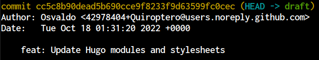

# The issue

I discovered a couple of days ago that my git installation is showing UTC timestamps
instead of my local offset (CDT in this moment of the year).

This is the output when executing `git log`:


The `+0000` part determines the UTC offset,
i.e. having `+0000` means that we are talking about UTC,
whereas `-0500` represents a delay (or negative offset) of five hours with respect to UTC, which is known as CDT.

This behavior of Git doesn't bother me most of the time,
but there's one use case when I'd like to have local timestamps,
which is correctly displaying the last modified date in my website posts.

# The solution

The easiest way to achieve the desired behavior is to tweak the
[Git environment variables](https://git-scm.com/book/en/v2/Git-Internals-Environment-Variables),
since I want to enable both possibilities commiting with UTC and local timestamps) possibilities.

I'm using **[zsh](https://www.zsh.org/)**, so I added the following function in my `~/.zshrc` file:

```zsh
function gcomdate() {
  export GIT_AUTHOR_DATE=$(date);
  export GIT_COMMITTER_DATE=$(date);
  git commit "$@"
}
```


That's just a shortcut to setting both environment variables each time that I want local timestamps in my commits.
For UTC timestamps I just commit the usual way.

Input:
```bash
git commit -m <message>
```
Output:


