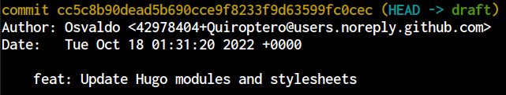
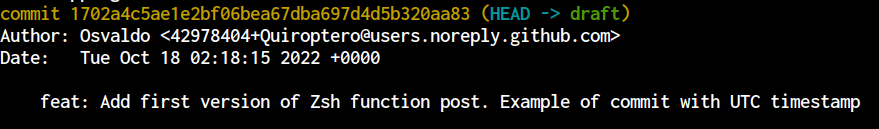

# El problema

Descubrí hace un par de días que mi instalación de git muestra marcas de tiempo en UTC,
en lugar de la zona horaria local (CDT en este momento del año).

Esta es la salida cuando ejecuto `git log`:


La parte `+0000` es la que determina la diferencia respecto a UTC;
es decir, `+0000` significa que precisamente estamos hablando de UTC,
mientras que `-0500` representa un «retraso» (o ajuste negativo) de cinco horas respecto a UTC,
lo cual se conoce como CDT.

Este comportamiento de Git no me importa la mayor parte del tiempo,
pero sí hay un caso de uso en el que me gustaría tener marcas de tiempo locales:
para mostrar la fecha de última modificación correcta en las entradas de este sitio web.

# La solución

Dado que quiero tener habilitadas las dos opciones (commits con marcas de tiempo UTC y locales),
la manera más sencilla de lograrlo es usando las
[variables de ambiente de Git](https://git-scm.com/book/en/v2/Git-Internals-Environment-Variables).

Estoy usando **[zsh](https://www.zsh.org/)**, así que agregué la siguiente función en mi archivo `~/.zshrc`:
```zsh
function gcomdate() {
  export GIT_AUTHOR_DATE=$(date);
  export GIT_COMMITTER_DATE=$(date);
  git commit "$@"
}
```

Ejecuta `source ~/.zshrc` para activar de inmediato la función o reinicia la sesión de la terminal.


Eso solo es un atajo para configurar ambas variables de entorno
cada vez que quiero marcas de tiempo locales en mis commits.
Para marcas de tiempo en UTC, simplemente realizo commits de la manera usual.

Entrada:
```bash
git commit -m <message>
```
Salida:


Entrada:
```bash
gcomdate -m <message>
```
Salida:
")

La función se encuentra en mis [archivos de configuración](https://github.com/Quiroptero/dotfiles).
