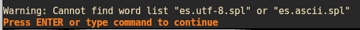
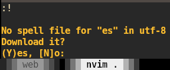

## TL;DR

Disabling the `netrw` plugin from Neovim can cause problems when downloading spellfiles.

---

## Neovim for writing prose and as a Pycharm replacement

This year I've been using Neovim as a personal challenge of sorts.
I got to Neovim because
I wanted a lightweight text editor to fill the hole left by Atom.
Neovim, at its core, is a text editor with, surprisingly, nothing but text in the UI.
The simplicity of its appearance and the good use it makes of screen estate
were among the first things that caught my eye.
I decided to give it a try for writing prose.

While doing this,
the idea of using Neovim as a replacement of a full IDE
(Pycharm is the one I mostly use)
soon grew in my mind.
A highly customizable text editor that runs from the terminal,
with lots of ways to use the screen estate 
and almost instantaneous start-up.
For me, it was like gamifying coding.

Although I don't think it's ~~possible~~ desirable to turn Neovim into an IDE
(the maintainers [do not think it either](https://neovim.io/charter/)),
I do think that many IDE-related features are really a convenience.
In order to get some of the good features of a mature IDE
I made adjustments to my local Neovim, mostly by using plugins.
For this, I relied heavily on the setup proposed by Josean Martinez
in his [YouTube channel](https://www.youtube.com/watch?v=6pAG3BHurdM),
with some changes here and there.
For reference, here are the [dotfiles](https://github.com/Quiroptero/dotfiles) I ended up with.
For more details on the structure of the directory with the configuration files
I recommend watching Josean's video.

## The nvim-tree plugin {#nvim-tree-plugin}

One of the plugins that I'm using is [nvim-tree](https://github.com/nvim-tree/nvim-tree.lua),
which is a customizable file explorer that replaces the builtin `netrw`.
In my opinion, `nvim-tree` has a nicer interface, among other great features.
Here's a comparison between `nvim-tree` and the default `netrw`:





Since `nvim-tree` and `netrw` are _mutually antagonistic_,
`nvim-tree` recommends turning off `netrw` in its [documentation](https://github.com/nvim-tree/nvim-tree.lua?tab=readme-ov-file#setup):

```lua
-- disable netrw at the very start of your init.lua
vim.g.loaded_netrw = 1
vim.g.loaded_netrwPlugin = 1
```

We'll get back to this in a moment.

## Enable spell check in Neovim {#enable-spell-check}

For the writing part, I wanted spell check to be enabled.
Fortunately, Neovim already includes such feature,
which you can enable via the variable `vim.opt`.
I have those options defined in `options.lua`.
To enable spell check for Spanish I added the following lines to the file:

```lua
-- .config/nvim/lua/osvaldo/core/options.lua
vim.opt.spelllang = "es"
vim.opt.spell = true
```

I restarted Neovim for the changes to take effect,
but then I got the following message:


Warning: Cannot find word list "es.utf-8.spl" or "es.ascii.spl"



I tried switching to English:

```lua
-- .config/nvim/lua/osvaldo/core/options.lua
vim.opt.spelllang = "en"
vim.opt.spell = true
```

This time it worked well, so the problem had to do with the language being Spanish.

After browsing several [reddit threads](https://www.reddit.com/r/neovim/comments/yi6e4a/spell_check/),
StackOverflow answers
and [reading the docs](https://neovim.io/doc/user/spell.html),
it was clear that the error was a `SpellFileMissing` —the Spanish language file was not installed.
Neovim stores language specifications as a reference for spell checking.
Given that I was enabling spell checking for the first time, Neovim hadn't yet installed anything.
However, Neovim _should_ prompt the user to install any missing spellfile,
but in my case that was not happening.

## Netrw handles downloads

[It turns out](https://www.reddit.com/r/neovim/comments/19d0we4/comment/kj4b4fk/)
that the built-in plugin `netrw` handles the downloads of spellfiles.
Remember the [nvim-tree plugin](#nvim-tree-plugin)?
According to its documentation,
it's better to disable the `netrw` plugin to avoid collisions with `nvim-tree`.
My configuration of `nvim-tree` included a couple of lines where `netrw` is disabled
—it was impossible for it to download anything.

The solution, then, was to disable `nvim-tree`, let `netrw` handle the missing files
and enable `nvim-tree` afterwards.

### Old issue

There is an [ongoing issue](https://github.com/neovim/neovim/issues/7189)
since mid-2017 in Neovim's Github related to this.
The central part is that Neovim relies on the download features of `netrw`
and thus the issue arises when the plugin is disabled.

Although the discussion on the issue has not been very active
a replacement appears to be in the works.
Until that gets shipped, there are workarounds available that require not much time.

## Workaround

### Disable nvim-tree

To disable `nvim-tree` we can pass a pair `enabled = false` to the table returned by the configuration file:

```lua
return {
    "nvim-tree/nvim-tree.lua",
    enabled = false,
    -- extra configuration
    end
}
```

### Enable netrw

In my configuration `netrw` is disabled as part of the config function passed to the setup of `nvim-tree`.
In other words, `netrw` gets enabled automatically after disabling `nvim-tree` in the previous step.
If the configuration should have disabled `netrw` in other place, the following lines would have enabled it:

```lua
vim.g.loaded_netrw = 0
vim.g.loaded_netrwPlugin = 0
```

### Enable spell check for Spanish

As explained [above](#enable-spell-check), the following lines enable spell check for Spanish:

```lua
vim.opt.spelllang = "es"
vim.opt.spell = true
```

### Restart Neovim

We need to restart Neovim for the changes of the previous three steps to take effect.
After that, Neovim prompts us to download the missing spellfiles:



Typing `Y` accepts the suggestion.
In my configuration the downloaded files are stored in a `spell` directory:

```commandline
$ tree .config/nvim/spell
> spell
  ├── en.utf-8.add
  ├── en.utf-8.add.spl
  ├── es.utf-8.spl
  └── es.utf-8.sug
```

### Disable netrw and enable nvim-tree

Once the download is completed, we can rollback the changes to both plugins.

In `nvim-tree.lua`:

```lua
return {
    "nvim-tree/nvim-tree.lua",
    -- enabled = false,  -- comment out this line to enable nvim-tree again
    -- extra configuration
    end
}
```

With this last change spell check is now enabled.

## Bonus

I defined a couple of keymaps to enable/disable spell checking for English and Spanish.

```lua
keymap.set("n", "<leader>z0", "<cmd>setlocal nospell<CR>", { desc = "Disable spell checking in the current buffer" })
keymap.set("n", "<leader>z1", "<cmd>setlocal spell spelllang=es<CR>", { desc = "Enable spell checking for Spanish in the current buffer" })
keymap.set("n", "<leader>z2", "<cmd>setlocal spell spelllang=en<CR>", { desc = "Enable spell checking for English in the current buffer" })
```

The configuration is in [the dotfiles](https://github.com/Quiroptero/dotfiles/blob/main/.config/nvim/lua/osvaldo/core/keymaps.lua#L26).
